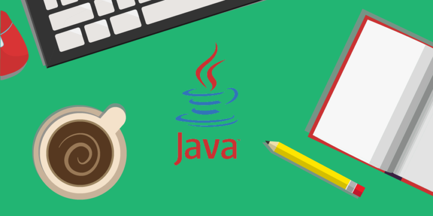

# Índice de contenidos
>Ordenado del más reciente al más antiguo  

<a href="https://github.com/daviiid99/Java_1DAM/tree/Animal_Minijuego">Clase Animal</a> 
<a href="https://github.com/daviiid99/Java_1DAM/tree/Gafas-abstract">Clase Gafas</a> 
<a href="https://github.com/daviiid99/Java_1DAM/tree/Electrodomestico-Refactorizacion">Clase electrodoméstico</a> 
<a href="https://github.com/daviiid99/Java_1DAM/tree/Tic_Tac_Toe">Tic Tac Toe v1</a> 
<a href="https://github.com/daviiid99/Java_1DAM/tree/mueble">Clase mueble</a> 
<a href="https://github.com/daviiid99/Java_1DAM/tree/Matrix">Clase Matriz</a> 
<a href="https://github.com/daviiid99/Java_1DAM/tree/examen">Clase cargador</a> 
<a href="https://github.com/daviiid99/Java_1DAM/tree/Planta">Clase planta </a> 
<a href="https://github.com/daviiid99/Java_1DAM/tree/Persona">Clase persona</a> 
<a href="https://github.com/daviiid99/Java_1DAM/tree/Coche">Clase Coche</a>  
<a href="https://github.com/daviiid99/Java_1DAM/tree/Coche">Prueba Inicial</a> 
